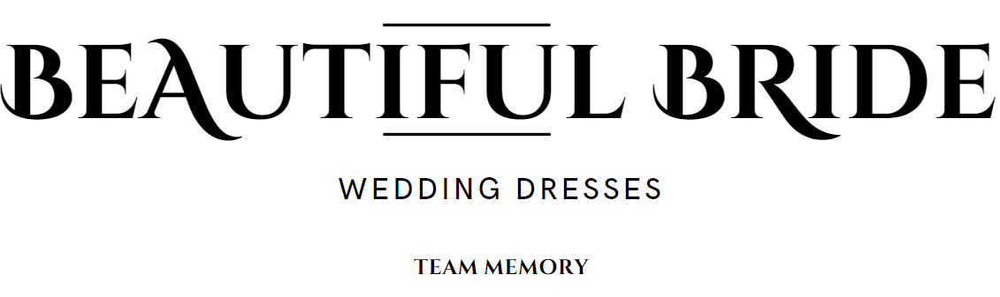
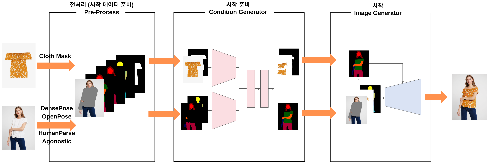
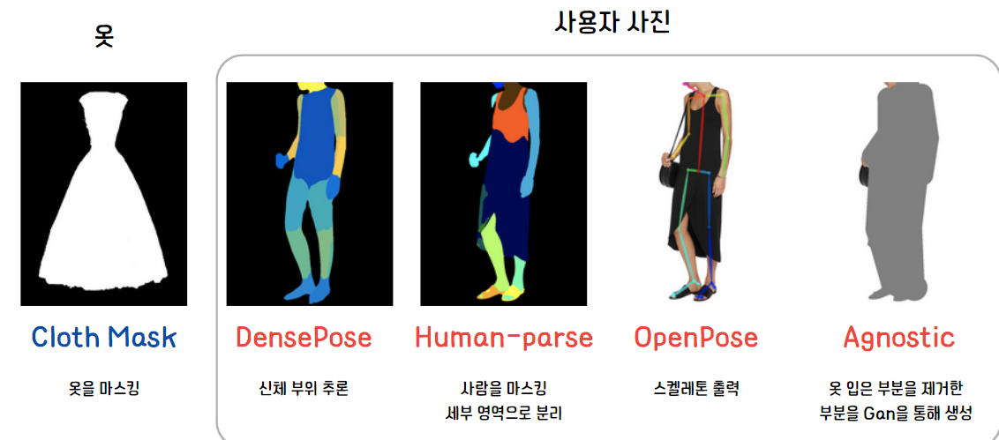
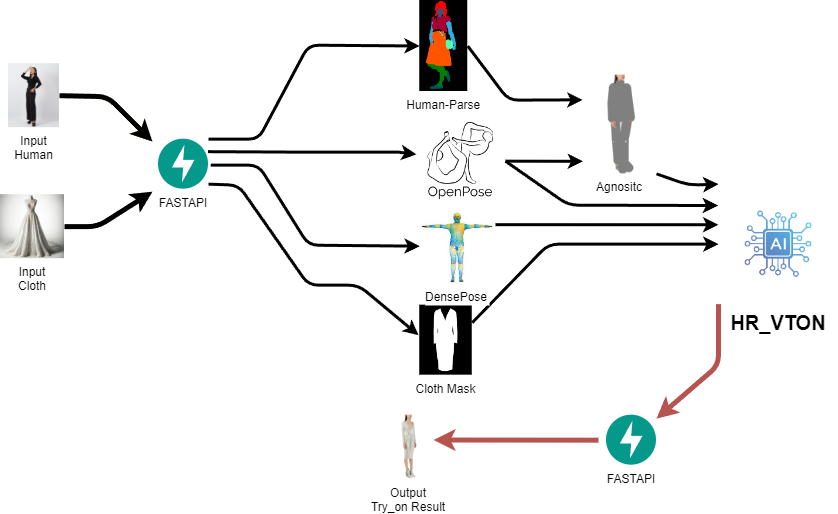
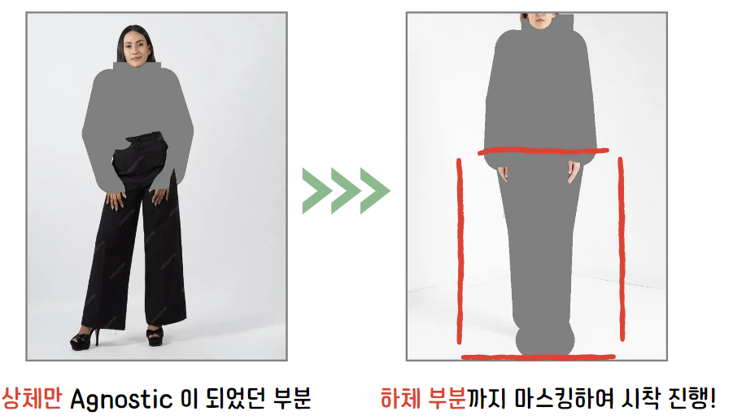
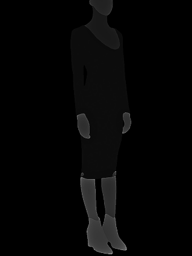
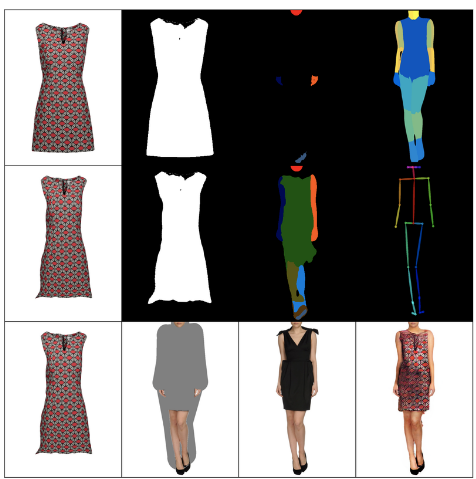

# Beatiful Bride
### 웨딩스레스 가상시착 서비스 파이프라인 (Fast Api)



--- 
## 프로젝트 개요

- **진행기간 : 2023. 11. 29. ~ 2024. 1. 18. (8주)**
- **참여 인원**:장성근,지유빈,이승민,백동현,김동철
- **예비 신부를 위한 웨딩드레스 가상 시착 서비스로 현재 웨딩드레스를 선택하고자 하는 소비자에게**
- **가상으로 웨딩드레스를 웹서비스에 입어보게 함으로 가상시착 서비스를 제공하는 프로젝트**


  현재 프로젝트에서 사용하는 AI모델은 HR-VITON으로 
  예비신부에게 웨딩드레스를 시착하기 위한 목적으로 맞지 않는 학습이 진행되어 있어
  본 프로젝트에서는 파인튜닝을 진행하여 본 프로젝트에 목적에 맞게 설계하여 진행하였음

>프로젝트 발표자료  
> https://www.canva.com/design/DAF5Wkjctk4/rkYvh7ZNtF9kPXiTZOQKuQ/edit?utm_content=DAF5Wkjctk4&utm_campaign=designshare&utm_medium=link2&utm_source=sharebutton


---   
>https://github.com/BeatifulBride/ForntEnd 프론트엔드  
>https://github.com/BeatifulBride/BackEnd 백엔드  
>https://github.com/BeatifulBride/FindTuning-HR-VITON 파인튜닝
--- 
## AI 모델 사용과정



### Base Model : HR-VITON (High-Resolution VIrtual Try-ON)

#### 1. Condition Generator

옷을 착용할 신체 영역 및 워핑할 의류 영역 이미지 생성

- 착용할 신체 영역 : 바뀔 상의의 신체 영역
- 워핑할 의류 영역 : 신체에 맞게 변형한 옷을 제공함

#### 2. Image Generator

Condition 제네레이터를 가지고 사용자 영역에서 agnostic 전처리에 해당되는
마스킹 영역에 옷을 시착하여 제공함

#### 3. 모델의 사용 과정

사용자의 사진과 시착할 옷의 사진을 입력받아
시착할 옷은 image mask 전처리를 거치고
사용자의 사진에서 전처리 총 4개를 거친뒤
모델에 전달하면 사용자 사진에서 해당되는 영역에 시착한 형태로 출력이 나오게 된다


##  전처리 과정
  참조: https://github.com/sangyun884/HR-VITON/blob/main/Preprocessing.md
  
    

#### 1.human parse
    https://github.com/Engineering-Course/CIHP_PGN
#### 2.openpose
    https://github.com/CMU-Perceptual-Computing-Lab/openpose
#### 3.densepose
    https://github.com/facebookresearch/DensePose
#### 4.agnositc
    HR-Vtion 모델 과정 내에 존재하는 마지막 전처리 과정
#### 5.clouth mask
    https://github.com/OPHoperHPO/image-background-remove-tool


##### 트레이닝 옵션 참조-> fintuning 레포지토리 참조

#### 3. HR-VITON 전신을 기준으로 파인튜닝 된 후 상체에서 하체를 학습하여 시착이 완료되었음


## 파이프라인 구조

- 현재 전처리는 각각의 api 형태로 제공하는 형태로 모델에 전달하여 모델을 서빙하기 위한 구조로 설계되어 있다


<div style="display: flex; justify-content: space-around;">
  
</div>

#### 1. 개발환경 구축

본프로젝트에서는 openpose 전처리의 환경 구성문제를 제대로 해결하지 못하여  
humanparse 전처리만 리눅스에서 구동시켜야 하는 문제가 있다  
이러한 문제를 가지고 있으니 human parse 전처리만 리눅스로 따로 서빙하여 제공하여야 한다

human parse 전처리를 제외한 나머지 환경은 모두 python3.8으로 구축이 가능하였다

### 나머지 전처리 환경 구축
    conda env -n hpenv python 3.8  
    pip install -r requirement.txt  

### humanparse 전처리 구축
    conda env -n hpenv python 3.7  
    pip install -r fastapi-hmanparse/requirement.txt


**전처리 humanparse 과정의 문제점이니 꼭 프로젝트를 사용시에 참고해주세요**  
humanparse 전처리에 사용된 cihp프로젝트의 문제는 weight파일을 따로 다운로드하여 제공해야 하며
이 weight파일과 프로젝트의 환경구성이 cpu 환경에 맞게 구성되어있어 gpu로 구동시에는 제대로 된 처리값이 나오지 않게 됩니다
이러한 이유로 cpu로 구동해야 하며 무조건 리눅스 환경에서 구성되어야 하는 문제가 있습니다


## AI모델 수정내역

- 웨딩드레스 시착을 위해 기존 ai 모델의 상체 부분만 마스킹 되어있던 부분을  
하체까지 마스킹하여 전신 드레스를 제공할 수 있게 수정하였습니다
- human parse,openpose 데이터를 참조하였습니다

```python
    #9,12 엉덩이
    #9 오른쪽엉덩이 10 오른쪽 무릎 11 오른쪽 발목
    agnostic_draw.line([tuple(pose_data[i]) for i in [9]], 'gray', width=r * 12)
    draw_img_RGB(agnostic,'9')
    # get_img_agnosic.py 참조
```

    fastapi/agnostic은 데이터셋을 만들기위한 코드로
    서비스 구동시 제공되는 코드가 아니니 참고해주세요
    (hr-viton 내부 함수에서 이루어집니다)
    
### humanparse 데이터는 grayscale로 이루어진 이미지로 제공되어야 합니다
  

- hr-viton은 이 데이터의 사람 신체 영역 구분을 이미지의 픽셀값으로 확인하기때문에
- 0~20까지의 값으로 이루어진 grayscale 이미지로만 제공되어야 합니다

## 구동화면 /결과


- 전처리 과정 및 모델 추론 결과

- 웹서비스 구동화면

## 해당 프로젝트의 참고 프로젝트
**https://github.com/Johyonghoon/project-Howsfit**  

**https://koo616.github.io/HR-VITON/**

본 레포지토리는 howsfit프로젝트를 기반으로 하드코딩되어 기능만 수행할 수 있게 작성된 레포지토리이며
리펙터링이 필수적으로 요구되는 바입니다


